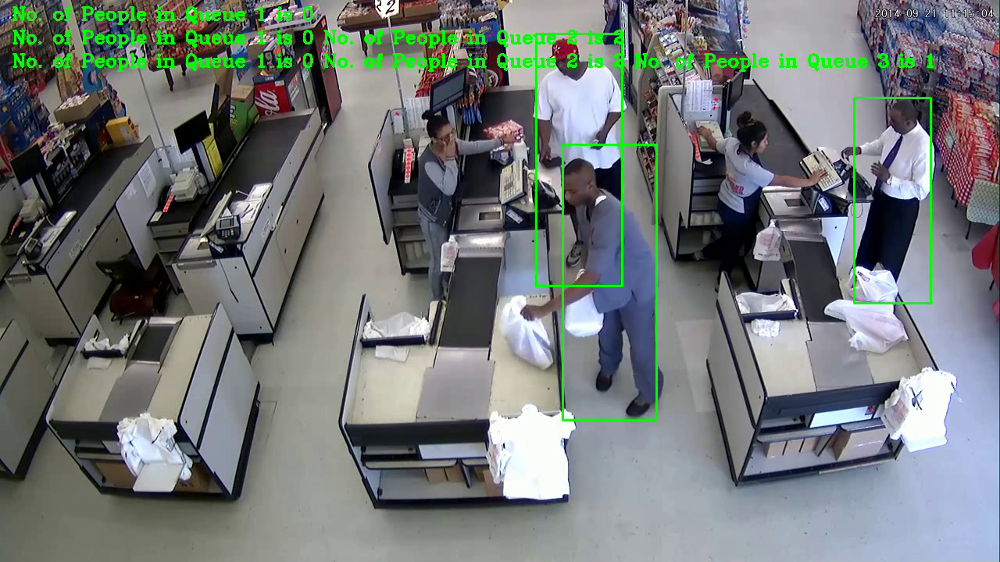
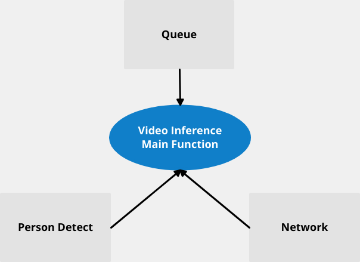

## Code executed in Intel Edge Cloud

```bash

#!/bin/bash

# TODO: Create DEVICE variable
DEVICE=$1
# TODO: Create MODEL variable
MODEL=$2
# TODO: Create VIDEO variable
VIDEO=$3
# TODO: Create QUEUE variable
QUEUE=$4
OUTPUT=$5
# TODO: Create PEOPLE variable
PEOPLE=$6
# mkdir -p $OUTPUT

python queue_app.py  --model ${MODEL} \
                          --device ${DEVICE} \
                          --video ${VIDEO} \
                          --output ${OUTPUT} \
                          --queue_param ${QUEUE} \
                          --max_people ${PEOPLE} \
                          --confidence_level 0.65 \

# cd /output

# tar zcvf output.tgz *

```

## Queue Class from Project

```python

class Queue:
    '''
    Class for dealing with queues
    '''
    def __init__(self):
        self.queues=[]

    def add_queue(self, points):
        self.queues.append(points)

    def get_queues(self, image):
        for q in self.queues:
            x_min, y_min, x_max, y_max=q
            frame=image[y_min:y_max, x_min:x_max]
            yield frame
    
    def check_coords(self, coords):
        d={k+1:0 for k in range(len(self.queues))}
        check = {}
        for ii,coord in enumerate(coords):
            for i, q in enumerate(self.queues):
                if coord[0]>int(q[0]) and coord[2]<int(q[2]):
                    d[i+1]+=1
                    check[ii] = True
        return d, check

```

## Load model into OpenVINO

```python

def load_model(self, model, device="CPU"):
        '''
        Load the model given IR files.
        Defaults to CPU as device for use in the workspace.
        Synchronous requests made within.
        '''
        model_xml = model
        model_bin = os.path.splitext(model_xml)[0] + ".bin"

        # Initialize the plugin
        self.plugin = IECore()

        # Read the IR as a IENetwork
        self.network = IENetwork(model=model_xml, weights=model_bin)

        # Load the IENetwork into the plugin
        self.exec_network = self.plugin.load_network(self.network, device, )

        return

```

## Queue Monitoring Result



## Model Classes



